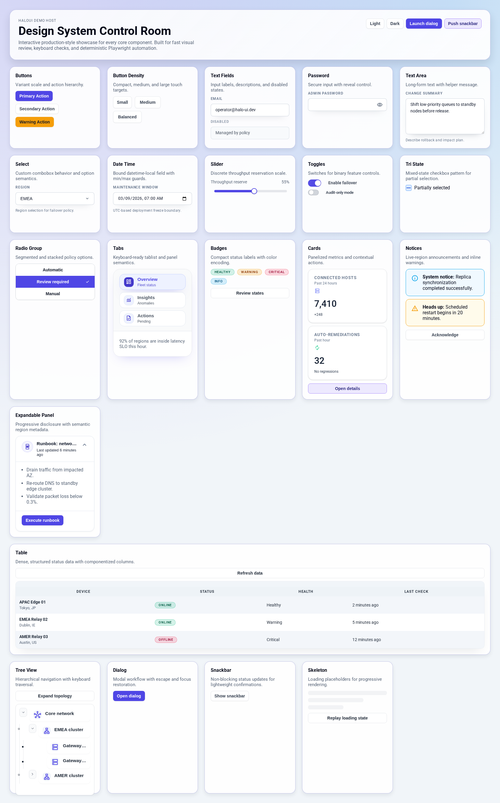
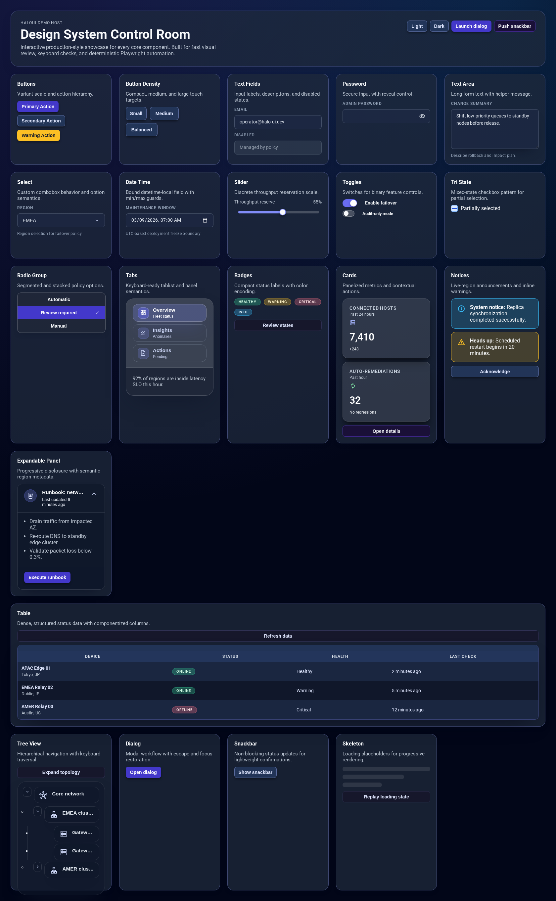
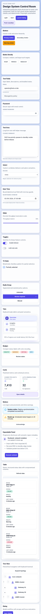
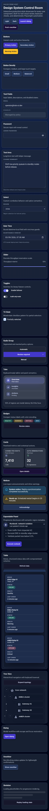
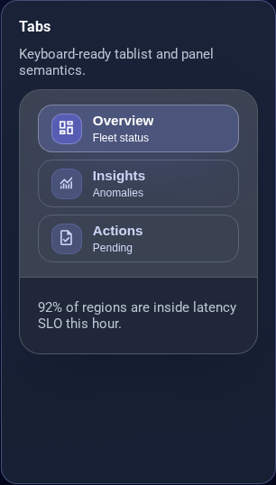
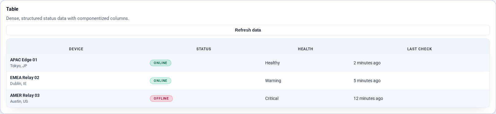
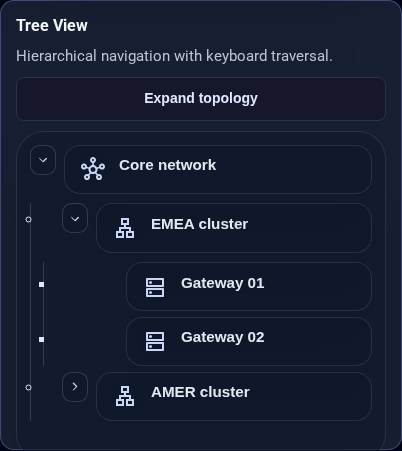
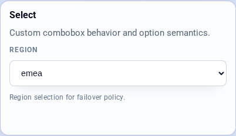
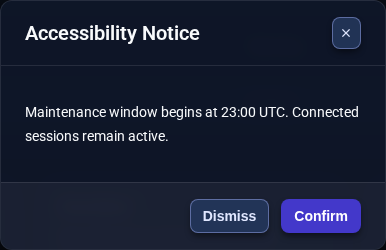
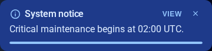

# HaloUI

HaloUI is a standalone Blazor component toolkit for building production UI with:
- consistent design tokens,
- strict accessibility semantics,
- responsive behavior by default,
- automated visual and interaction validation.

## Highlights
- Full component set: buttons, inputs, select, tabs, cards, tables, trees, dialogs, snackbars, toggles, skeletons.
- Token-driven styling and theme-aware rendering.
- Keyboard and ARIA-first component contracts.
- Provider-based icon abstraction (`IHaloIconResolver`) with no hard dependency on a specific icon library.
- Built-in demo host for rapid development and manual QA.
- Playwright matrix suite (desktop/tablet/mobile x light/dark x component contracts).
- Scoped axe accessibility suite for critical WCAG checks.

## Repository layout
- `HaloUI/` component library and theming infrastructure.
- `HaloUI.IconPacks.Material/` embedded Material icon pack project (typed catalog + manifests + DI helper).
- `HaloUI.DemoHost/` runnable showcase app with real component scenarios.
- `HaloUI.Tests/`, `HaloUI.Tests.E2E/` component-level and end-to-end validation.
- `tests/accessibility/` Playwright + axe automation.
- `tests/docs/media/` generated gallery screenshots for docs.

## Local development

### Prerequisites
- .NET 10 SDK
- Node.js 20+

### Build
```bash
dotnet restore HaloUI.slnx
dotnet build HaloUI.slnx -c Debug
```

### Run DemoHost
```bash
dotnet run --project HaloUI.DemoHost/HaloUI.DemoHost.csproj --urls http://127.0.0.1:5210
```

## Icons
HaloUI components render icons through `HaloIcon` + `IHaloIconResolver`.
This lets hosts plug any icon stack (ligature fonts, glyph fonts, SVG path packs, CSS sprite classes).

Quick registration examples:

```csharp
// Generic ligature resolver (no vendor lock-in):
services.AddHaloUIPassthroughLigatureIcons("my-icon-font-class");
```

```csharp
// Embedded Material pack resolver:
services.AddHaloUIMaterialIconPack(HaloMaterialIconStyle.Outlined);
```

Generate full Material icon manifests (all official `.codepoints` styles):

```bash
./scripts/generate-material-icon-packs.sh
```

This writes JSON manifests to `HaloUI.IconPacks.Material/Iconography/Packs/Material/`.

## Runtime contracts
- Snackbar API is request-first: use `ISnackbarService.Enqueue(SnackbarRequest)` and `SnackbarRequest.Info/Success/Warning/Error`.
- `ISnackbarService` no longer exposes message-level helper methods.
- HaloUI runtime JS is limited to two explicit modules:
  - `dialogAccessibility.js` via `IOverlayRuntime` (focus trap, body scroll lock).
  - `selectPositioning.js` via `ISelectPositioningRuntime` (viewport-aware HaloSelect placement).
- No additional component JS module dependencies are allowed without contract/test updates.
- Component coverage contracts for bUnit and Playwright are centralized in `contracts/component-contracts.json`.
- Public API compatibility is pinned by `contracts/public-api.txt` and validated in tests.

## Accessibility and UI automation
From `tests/accessibility`:

```bash
npm ci
npx playwright install chromium
```

Run contract matrix:
```bash
HALOUI_SKIP_WEBSERVER=1 HALOUI_A11Y_PORT=5210 npm run test:matrix
```

Run critical a11y scans:
```bash
HALOUI_SKIP_WEBSERVER=1 HALOUI_A11Y_PORT=5210 npm run test:a11y
```

Run performance budgets:
```bash
HALOUI_BUILD_CONFIGURATION=Release npm run test:perf
```

Generate screenshot gallery:
```bash
HALOUI_SKIP_WEBSERVER=1 HALOUI_A11Y_PORT=5210 npm run screenshots
```

Update public API baseline intentionally:
```bash
HALOUI_UPDATE_PUBLIC_API_CONTRACT=1 dotnet test HaloUI.Tests/HaloUI.Tests.csproj --filter FullyQualifiedName~PublicApiContractTests
```

## Planning
- Active roadmap: `ROADMAP.md`

## Screenshot gallery

### Full pages





### Section captures





### Interactive states



## License
HaloUI is dual-licensed under either:

- MIT ([LICENSE-MIT](LICENSE-MIT))
- Apache-2.0 ([LICENSE](LICENSE))

at your option.

Unless explicitly stated otherwise, submitted contributions are accepted under
the same dual-license terms.
